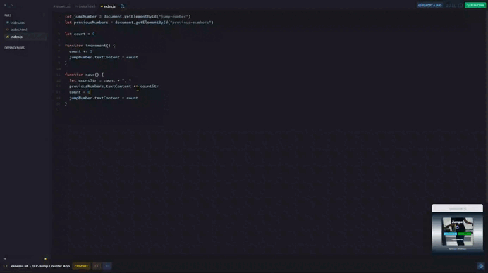

# Jump Counter App

## *Overview* 🧐

This project is part of the **Making Websites Interactive** module of [**Scrimba**](https://v2.scrimba.com/home)'s [**Frontend Career Path**](https://v2.scrimba.com/the-frontend-developer-career-path-c0j) course. We developed an app called **Jump Counter App**, which allows users to count the number of jumps (or any other repetitive action) by clicking on an interactive button.

## *Requirements* 📝

✅ Title: choose something that interests you.

✅ Background image.

✅ Font: select a custom font.

✅ Button colors and appearance: include options like width, border, etc.

✅ Wrap a div around the HTML, add a max width.

## *Pseudocode* 🗒️

1. Intialize the count as 0.

1. Listen for clicks on the increment button.

1. Increment the count variable when the button is clicked.

1. Change the `count-el` in the HTML to reflect the new count.

## *Screenshots* 📷

## *Links* 🔗

[Scrim code](https://v2.scrimba.com/s0enpe14p6) 👈

[Live site](https://mendezpvi.github.io/fcp-jump-counter-app/) 👈

## *What I learned* 🤓

🔳 The `<script>` tag to link JavaScrip.

🔳 Declaration, reassignment and use of variables.

🔳 Data type such as **numbers** and **strings**.

🔳 Using `console.log()`.

🔳 Defining and using Functions.

🔳 Methods like `getElementById()`.

🔳 Updating DOM content with `innerText` and `textContent`.

## *Resources* 🗃️

📖 [textContent vs innerText](https://developer.mozilla.org/en-US/docs/Web/API/Node/textContent) by MDN.

## *Author* 🔰

✨ Frontend Mentor - [@medezpvi](https://www.frontendmentor.io/profile/mendezpvi)

✨ X (formerly Twitter) - [@medezpvi](https://x.com/mendezpvi)